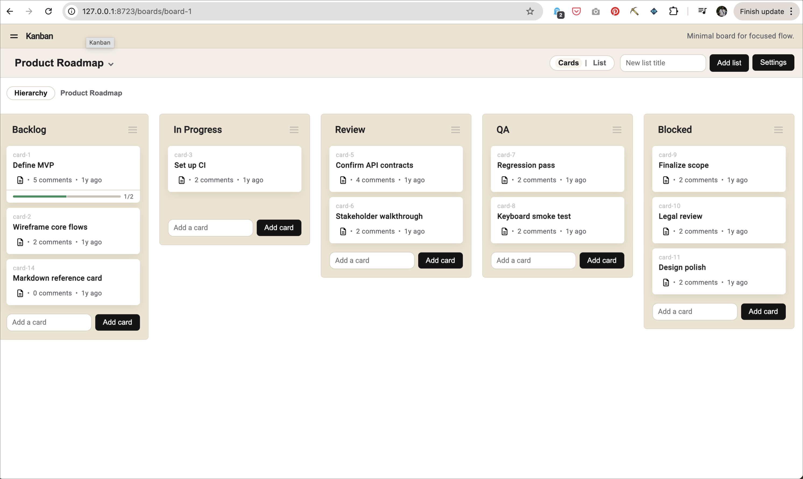
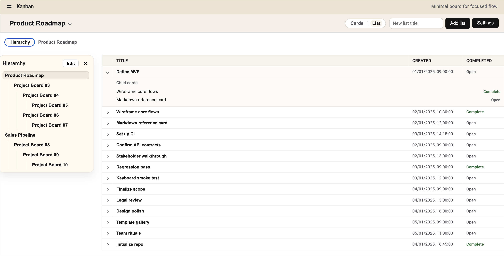
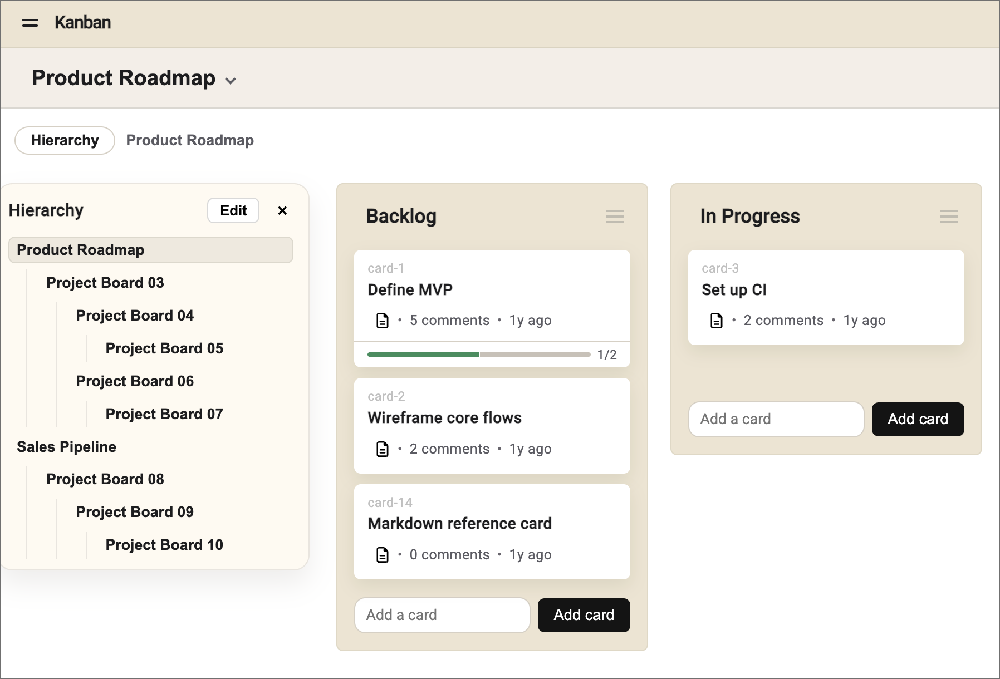
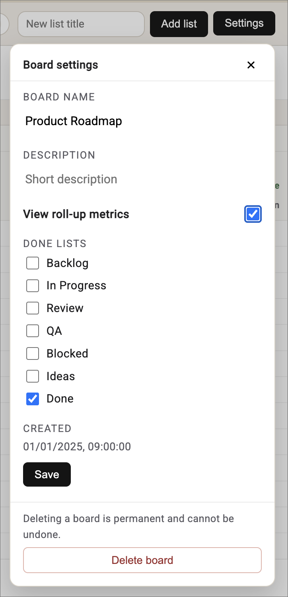
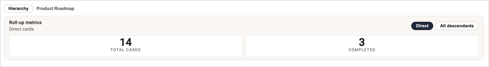
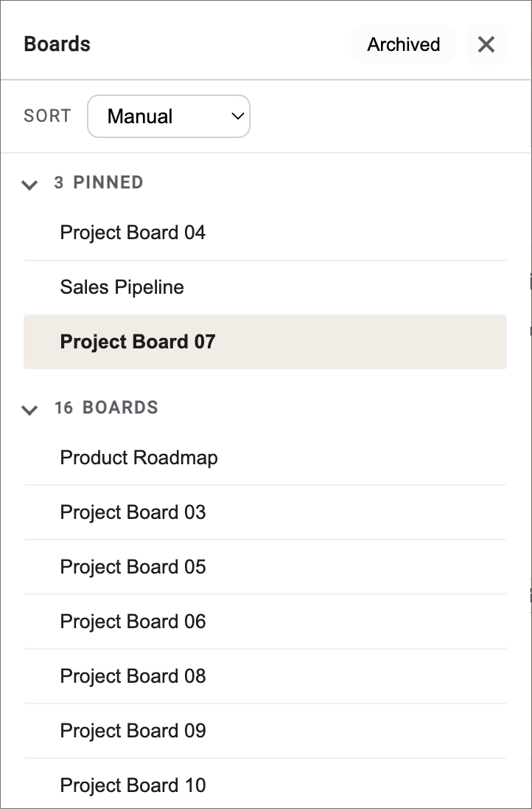
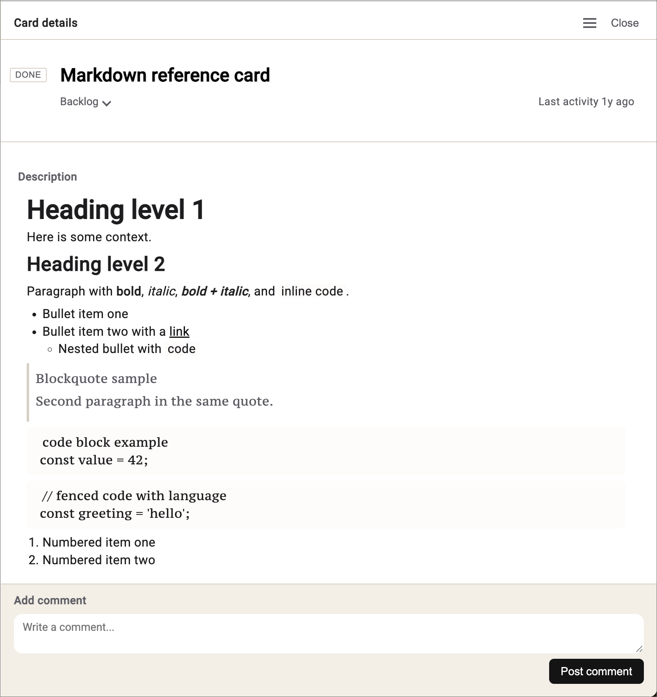
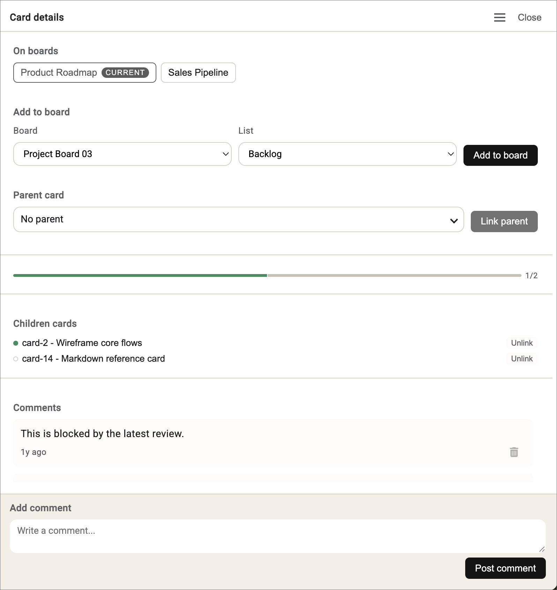

# Osoyah

Kanban app with FastAPI backend and Angular frontend.

## Features

### Kanban board view

Classic column layout with cards grouped by status for fast scanning. Naturally, this supports drag-n-drop :)

Cards can be nested and when this is done, you can see the "Done" status of the child cards (e.g. on the Define MVP card).

### List mode view

Compact list layout optimized for dense card browsing. Additionally, you get easy to the nested child cards and their status.

### Board hierarchy

Parent/child board relationships for organizing work across spaces. I was curious about how to make it easy to jump between boards and also having nested boards.

This was implemented using the Hierarchy option.

### Board settings

Single place to manage titles, descriptions, and configuration.

Also implemented was the ability to define multiple "Done" queues. This could potentially be useful if you had a CRM and had different types of Closed-Won states.

### Board metrics

We also have basic Rollup metrics to track totals and completion progress. This also include the ability to roll-up metrics across multiple boards.

### Pinning and archiving

Pin active boards and archive inactive ones to keep focus.

### Markdown support

Cards have a focused, detail view for editing titles, descriptions, and status (the DONE button).

Notes can also be captured and rendered in markdown for rich, structured notes and formatting.

### Card details

Also present is the ability to add cards to multiple boards. In this example, the cards is on the Product Roadmap board and Sales Pipeline board.

I found it useful to include an easy way to have a parent card.

Other features include:

-   Child cards
-   Comments (with relative time)

# Development details

## Running the app

-   Backend: `python backend/scripts/install_deps.py`, then `python backend/scripts/app.py --env dev`
-   Frontend: `cd client` then `npm install` and `npm start`

## Spec-driven development

This project is built using spec-driven development. All work is scoped to a spec under `specs/`, with workflow and guardrails defined in `docs/process.md`.

## Docs to read first

-   `docs/README.md` for the docs index
-   `docs/process.md` for workflow and guardrails
-   `docs/principles.md` for engineering/product principles
-   `docs/ux-patterns.md` for UX guidance
-   `docs/api/README.md` for API docs (including `docs/api/openapi.json`)

## Principles

All specs and milestones must conform to `docs/principles.md`.
UX consistency guidelines live in `docs/ux-patterns.md`.

## Structure

-   `backend/server/` FastAPI backend
-   `client/` Angular frontend
-   `specs/` Milestone and spec documentation
-   `docs/` Architecture and decisions
-   `infra/` Deployment and CI
-   `backend/scripts/` Developer scripts
-   `session-hand-off.md` Current session status
-   `session-hand-offs/` Session hand-off entries (`yyyy-mm-dd-title.md`)
